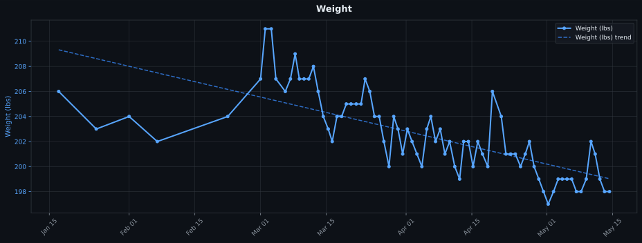
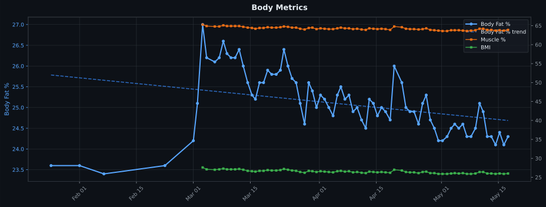

## 📊 Health Metrics Glossary

| Metric | Definition |
|--------|------------|
| **Weight** | Total body mass in pounds. |
| **BMI** | *Body Mass Index* — weight relative to height (kg/m²). A general obesity screening tool, but doesn't distinguish fat from muscle. |
| **Body Fat %** | Percentage of total mass that is fat tissue. Includes essential fat (organs, nerves) and storage fat. |
| **Muscle %** | Percentage of total mass that is skeletal muscle. Higher is generally better for metabolism and strength. |
| **Body Water %** | Percentage of total mass that is water. Healthy range is ~50–65% for adults. Fluctuates daily based on hydration, food, and activity. |
| **Bone Mineral** | Estimated mass of minerals (primarily calcium) in your bones, in kg. An indicator of bone density. |
| **Protein %** | Percentage of total mass made up of protein (found in muscle, organs, and connective tissue). |
| **Metabolic Age** | Compares your BMR to the average BMR for age groups — gives you the age whose average metabolism yours most closely matches. Lower than your actual age = good. |
| **BMR** | *Basal Metabolic Rate* — calories your body burns at complete rest just to sustain basic functions (breathing, circulation, cell repair). Everything else you burn is on top of this. |

---

## 🛠️ Fitness Tracking Tools

| Tool | Type | Purpose |
|------|------|---------|
| [Wyze Scale X](https://www.wyze.com/products/wyze-scale-x) | Smart Scale | Daily weigh-ins — weight, BMI, body fat %, muscle %, body water %, bone mineral, protein %, metabolic age, BMR |

---

> ⚖️ **Note on Wyze scale accuracy:** Bioelectrical impedance measurements (body fat, muscle, water, etc.) are estimates and can vary significantly based on hydration, time of day, and foot placement. Track trends over weeks, not individual readings.

---

---

| Date | Weight | BMI | Body Fat | Muscle | Body Water | Bone Mineral | Protein | Metabolic Age | BMR | Notes |
| ---------- | --- | --- | --- | --- | --- | --- | --- | --- | --- | --- |
| 2025-08-19 | 215 | | 26.1% | | | | | | | |
| 2025-09-22 | 208 | | 24.7% | | | | | | | |
| 2025-09-29 | 211 | | 25.5% | | | | | | | |
| 2025-10-10 | 203 | | 23.4% | | | | | | | |
| 2025-10-27 | 204 | | 23.7% | | | | | | | |
| 2025-11-04 | 209 | | 24.0% | | | | | | | |
| 2025-11-11 | 208 | | 24.3% | | | | | | | |
| 2025-11-15 | 200 | | 22.8% | | | | | | | |
| 2025-11-22 | 206 | | 24.2% | | | | | | | |
| 2025-11-29 | 200 | | 22.7% | | | | | | | |
| 2025-12-06 | 204 | | 23.7% | | | | | | | |
| 2025-12-14 | 203 | | 23.4% | | | | | | | |
| 2025-12-20 | 208 | | 24.2% | | | | | | | Christmas Cookies! |
| 2026-01-10 | 204 | | 23.7% | | | | | | | |
| 2026-01-17 | 206 | | 24.1% | | | | | | | |
| 2026-01-25 | 203 | | 23.6% | | | | | | | |
| 2026-02-01 | 204 | | 23.6% | | | | | | | |
| 2026-02-07 | 202 | | 23.4% | | | | | | | |
| 2026-02-22 | 204 | | 23.6% | | | | | | | |
| 2026-03-01 | 207 | | 24.2% | | | | | | | |
| 2026-03-02 | 211 | | 25.1% | | | | | | | |
| 2026-03-03 06:43:50 | 211 | 27.6 | 27.0% | 65.3% | 53.4% | 4.3 | 15.1% | 42 | 1875 | |
| 2026-03-04 06:19:59 | 207 | 27.1 | 26.2% | 64.9% | 54.0% | 4.2 | 15.2% | 42 | 1865 | |
| 2026-03-06 06:21:06 | 206 | 27.0 | 26.1% | 64.8% | 54.0% | 4.2 | 15.2% | 42 | 1864 | |
| 2026-03-07 08:43:35 | 207 | 27.1 | 26.2% | 64.8% | 54.0% | 4.2 | 15.2% | 42 | 1863 | |
| 2026-03-08 08:45:04 | 209 | 27.3 | 26.6% | 65.1% | 53.7% | 4.3 | 15.1% | 42 | 1869 | |
| 2026-03-09 06:21:32 | 207 | 27.1 | 26.3% | 64.9% | 53.9% | 4.2 | 15.2% | 42 | 1864 | Stopping morning figs and dates. Rest days, no meals before 11. Rest week, Cardio Only. |
| 2026-03-10 06:16:13 | 207 | 27.1 | 26.2% | 64.9% | 54.0% | 4.2 | 15.2% | 42 | 1865 | Rest week, Cardio Only. |
| 2026-03-11 06:19:12 | 207 | 27.1 | 26.2% | 64.9% | 54.0% | 4.2 | 15.2% | 42 | 1865 | Rest week, Cardio Only. |
| 2026-03-12 06:16:19 | 208 | 27.2 | 26.4% | 64.9% | 53.8% | 4.2 | 15.2% | 42 | 1865 | Rest week, Cardio Only. |
| 2026-03-13 06:28:41 | 206 | 27.0 | 26.0% | 64.7% | 54.1% | 4.2 | 15.3% | 42 | 1861 | Rest week, Cardio Only. |
| 2026-03-14 08:36:27 | 204 | 26.7 | 25.6% | 64.5% | 54.4% | 4.2 | 15.4% | 42 | 1856 | Rest week, Cardio Only. |
| 2026-03-15 09:46:40 | 203 | 26.6 | 25.3% | 64.4% | 54.6% | 4.2 | 15.4% | 42 | 1854 | Rest week, Cardio Only. |
| 2026-03-16 06:17:56 | 202 | 26.5 | 25.2% | 64.2% | 54.7% | 4.2 | 15.4% | 42 | 1849 | Exercise program restart. |
| 2026-03-17 06:20:59 | 204 | 26.7 | 25.6% | 64.4% | 54.4% | 4.2 | 15.4% | 42 | 1854 | |
| 2026-03-18 06:17:18 | 204 | 26.7 | 25.6% | 64.4% | 54.4% | 4.2 | 15.4% | 42 | 1854 | |
| 2026-03-19 06:18:06 | 205 | 26.9 | 25.9% | 64.6% | 54.2% | 4.2 | 15.3% | 42 | 1858 | |
| 2026-03-20 06:22:17 | 205 | 26.8 | 25.8% | 64.5% | 54.3% | 4.2 | 15.3% | 42 | 1857 | |
| 2026-03-21 08:59:31 | 205 | 26.8 | 25.8% | 64.5% | 54.3% | 4.2 | 15.3% | 42 | 1857 | |
| 2026-03-22 09:37:57 | 205 | 26.9 | 25.9% | 64.6% | 54.2% | 4.2 | 15.3% | 42 | 1858 | Post ramadan feast! |
| 2026-03-23 06:20:13 | 207 | 27.2 | 26.4% | 64.8% | 53.8% | 4.2 | 15.2% | 42 | 1864 | Post ramadan feast! |
| 2026-03-24 06:21:09 | 206 | 27.0 | 26.0% | 64.7% | 54.1% | 4.2 | 15.3% | 42 | 1861 | |
| 2026-03-25 06:20:38 | 204 | 26.8 | 25.7% | 64.5% | 54.3% | 4.2 | 15.3% | 42 | 1856 | No meals before 10AM or after 6PM starting today. Morning shake is still first thing in the AM. |
| 2026-03-26 06:21:52 | 204 | 26.7 | 25.6% | 64.5% | 54.4% | 4.2 | 15.4% | 42 | 1856 | |
| 2026-03-27 06:22:30 | 202 | 26.4 | 25.1% | 64.2% | 54.8% | 4.2 | 15.5% | 42 | 1850 | |
| 2026-03-28 08:33:11 | 200 | 26.2 | 24.6% | 64.0% | 55.1% | 4.2 | 15.6% | 42 | 1845 | |
| 2026-03-29 08:43:18 | 204 | 26.7 | 25.6% | 64.4% | 54.4% | 4.2 | 15.4% | 42 | 1854 | Second anniversary feast! |
| 2026-03-30 06:22:05 | 203 | 26.6 | 25.4% | 64.5% | 54.6% | 4.2 | 15.4% | 42 | 1855 | |
| 2026-03-31 06:32:22 | 201 | 26.4 | 25.0% | 64.1% | 54.8% | 4.2 | 15.5% | 42 | 1847 | |
| 2026-04-01 06:24:01 | 203 | 26.6 | 25.3% | 64.3% | 54.6% | 4.2 | 15.4% | 42 | 1852 | Cut breakfast chia seeds from 4 tbsp to 2 |
| 2026-04-02 06:19:46 | 202 | 26.5 | 25.2% | 64.2% | 54.7% | 4.2 | 15.4% | 42 | 1849 | |
| 2026-04-03 07:20:55 | 201 | 26.4 | 25.0% | 64.1% | 54.8% | 4.2 | 15.5% | 42 | 1847 | |
| 2026-04-04 08:35:01 | 200 | 26.3 | 24.8% | 64.1% | 55.0% | 4.2 | 15.5% | 42 | 1846 | |
| 2026-04-05 09:40:28 | 203 | 26.6 | 25.3% | 64.3% | 54.6% | 4.2 | 15.4% | 42 | 1852 | |
| 2026-04-06 06:22:28 | 204 | 26.7 | 25.5% | 64.5% | 54.5% | 4.2 | 15.4% | 42 | 1856 | |
| 2026-04-07 06:24:02 | 202 | 26.5 | 25.2% | 64.3% | 54.7% | 4.2 | 15.4% | 42 | 1851 | |
